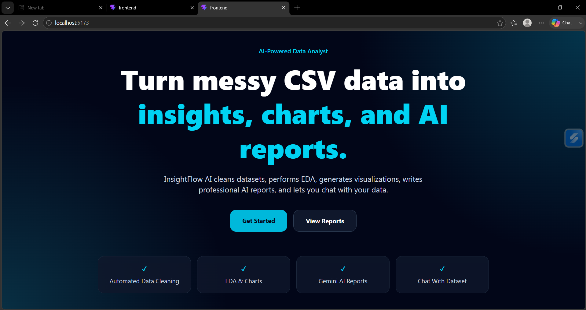
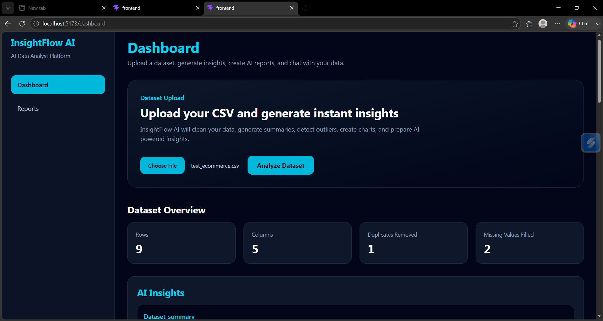
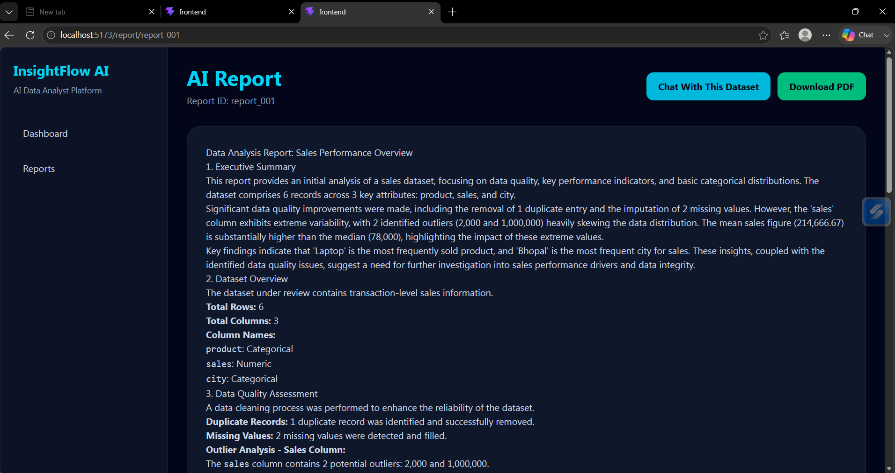
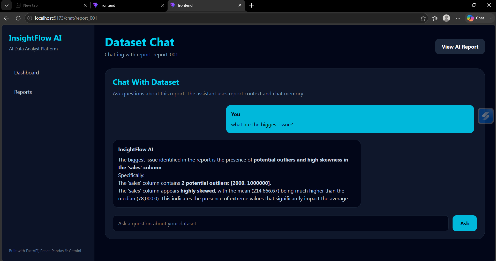
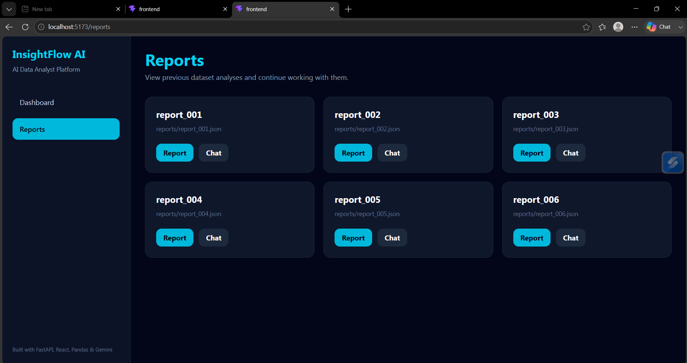

# InsightFlow AI

> AI-Powered Automated Data Analyst & Insight Engine

InsightFlow AI is a full-stack data analysis platform that automates the workflow of a junior data analyst. Users can upload CSV datasets, automatically clean and analyze data, generate visualizations, create AI-powered business reports, and chat with their datasets through a modern web interface.

---

## Features

### Data Processing

* CSV Upload
* Missing Value Handling
* Duplicate Removal
* Outlier Detection (IQR)
* Automated Data Cleaning

### Data Analysis

* Exploratory Data Analysis (EDA)
* Automated Chart Generation
* Statistical Summaries
* Data Visualization

### AI Capabilities

* Gemini AI-Powered Insights
* AI Business Report Generation
* Dataset Question Answering
* AI Report Caching

### Data Persistence

* Report History
* Chat History Persistence
* JSON-Based Storage

### Downloads

* Cleaned Dataset Export
* Outlier-Removed Dataset Export
* PDF Report Export

### Frontend

* React Dashboard
* AI Report Viewer
* Dataset Chat Interface
* Report History Page
* Responsive UI with Tailwind CSS

---

## Screenshots

### Home Page



### Dashboard



### Report Page



### Dataset Chat



### Report History



---

## Tech Stack

### Backend

* Python
* FastAPI
* Pandas
* NumPy
* Matplotlib
* Gemini AI

### Frontend

* React
* Tailwind CSS
* React Router
* Axios

---

## Project Structure

```text
InsightFlow-AI/
│
├── backend/
│   └── app.py
│
├── frontend/
│
├── src/
│   ├── cleaner.py
│   ├── eda.py
│   ├── gemini_service.py
│   ├── llm.py
│   ├── pdf_generator.py
│   ├── pipeline.py
│   ├── qa.py
│   ├── report_generator.py
│   ├── reporting.py
│   ├── storage.py
│   └── visualizer.py
│
├── assets/
│   └── screenshots/
│
├── data/
├── uploads/
├── reports/
├── charts/
├── cleaned_data/
├── pdf_reports/
│
├── run_pipeline.py
├── requirements.txt
└── README.md
```

---

## Installation

### Backend

```bash
pip install -r requirements.txt
```

### Start Backend

```bash
uvicorn backend.app:app --reload
```

### Frontend

```bash
cd frontend
npm install
npm run dev
```

---

## Environment Variables

Create a `.env` file in the project root:

```env
GEMINI_API_KEY=your_api_key_here
```

---

## Live Demo

https://insight-flow-ai-taupe.vercel.app

---

## Current Version

```text
v1.0.0
```

---

## Future Improvements

* Authentication
* SQLite/PostgreSQL Integration
* Multi-User Architecture

---

## Author

Hariom Kale

Python Developer | FastAPI | React | AI-Powered Applications
